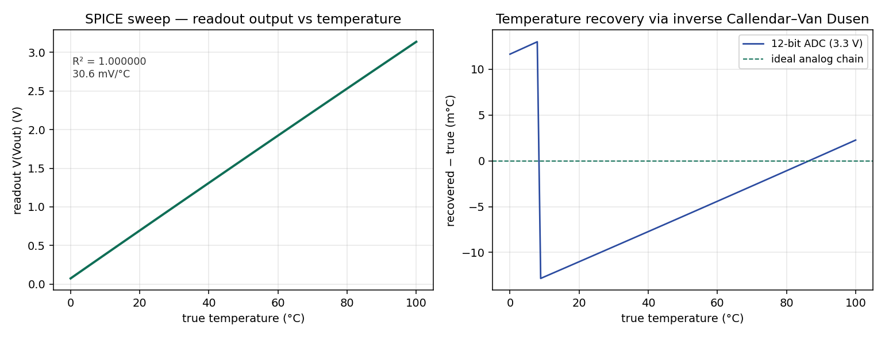
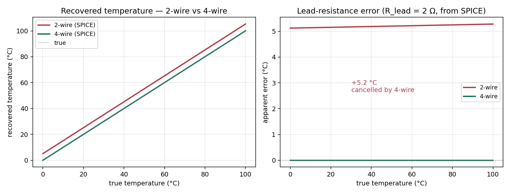

# PT100 RTD Readout: Constant-Current 4-Wire Platinum Thermometry with a SPICE-Validated Front-End

**Author:** Paulino "Paul" Gin · BS Applied Physics + BA Mathematics, Boston College (Class of 2027)
**Stack:** KiCad 8 (schematic capture) · ngspice (SPICE) · Python (NumPy / Matplotlib)
**Repo:** [github.com/paulggin/pt100-rtd-readout](https://github.com/paulggin/pt100-rtd-readout)

---

## Overview

This project designs and simulates the readout electronics for a PT100 platinum resistance thermometer, which is the sensor for the warmer stages of a dilution refrigerator (50 K plate, still, vacuum can, anything from ~30 K to room temperature). The deliverable is a KiCad schematic and a SPICE-validated model of the full readout chain: a constant-current excitation source, a 4-wire (Kelvin) connection to the sensor, and a two-stage amplifier that maps the sensor's 0–100 °C range to a clean 0–3 V output, with the temperature recovered from that output through the inverse Callendar–Van Dusen relation.

The work includes five stages:

1. Size the circuit against self-heating and output-range targets: a 1.000 mA excitation current, an INA128 instrumentation amplifier at a gain of 10, and a difference amplifier at a gain of 7.87 that subtracts the 0 °C baseline.
2. Capture the schematic in KiCad 8 and a simulation-ready variant that solves in ngspice.
3. Sweep the modeled sensor resistance from 100 Ω to 138.5 Ω (0 → 100 °C) and confirm the readout output is linear and in range.
4. Recover temperature from the simulated output through the inverse Callendar–Van Dusen relation and quantify the accuracy.
5. Insert a lead resistance into the sensed loop and compare the 2-wire and 4-wire topologies directly.

## Background

**A PT100 is a platinum element with 100 Ω of resistance at 0 °C that rises by about 0.385 Ω/°C** along the IEC 60751 standard curve. For T ≥ 0 °C the Callendar–Van Dusen relation is

```
R(T) = R0 (1 + A·T + B·T²),   R0 = 100 Ω,  A = 3.9083e-3 /°C,  B = -5.775e-7 /°C²
```

which gives 138.5 Ω at 100 °C. Platinum is the standard choice for the warmer cryostat stages because its resistance-temperature curve is well characterized and nearly linear; colder stages (4 K and below) switch to RuOx or Cernox because platinum's sensitivity flattens out at low temperature. In simulation the PT100 is replaced by a fixed resistor set to R(T) for each temperature point, so sweeping the resistor is equivalent to sweeping the sensor.

**Why 4-wire , not 2-wire** PT100 usually sits at the end of a meter or more of cryostat wiring, and that wiring has its own resistance — easily 1–2 Ω round trip on thin, low-thermal-conduction wire. In a 2-wire hookup that lead resistance adds directly to the measured resistance and reads out as a false temperature shift of several °C. A 4-wire hookup carries the excitation current on one pair of wires and senses the voltage on a separate pair; because the sense pair feeds a high-impedance amplifier and carries no current, the lead resistance in the sense path drops nothing and the error cancels.

## Methods

### Signal chain

The readout is a **1.000 mA constant-current source, a 4-wire PT100, and a two-stage amplifier** that produces 0–3 V over 0–100 °C.

- **Excitation — improved Howland current pump, 1.000 mA.** The current is set by a 2.5 V reference (REF3025) and a precision resistor, I = V_ref / R_set. A Howland pump sources a defined current into a *grounded* load, which keeps the PT100 at ground and the instrumentation-amplifier common-mode near 0.1 V. Its usual weakness, finite output impedance degrading current regulation as the load changes, is irrelevant here because the load only moves 38.5 Ω across the full range; with 0.1 % matched resistors the current shifts ~40 nA (0.004 %) across 0–100 °C. At 1.000 mA the sensor dissipates 100–139 µW, far below the self-heating threshold, and produces 0.385 mV/°C at its terminals.

- **Stage 1 — INA128 instrumentation amplifier, gain 10.107.** The two sense leads feed the high-impedance INA128 inputs (the Kelvin condition), producing 1.00–1.39 V across the range. The gain is set by a single external resistor, G = 1 + 50 kΩ/R_G.

- **Stage 2 — difference amplifier, gain 7.87.** A four-resistor subtractor removes the 1.000 V (0 °C) baseline and applies the remaining gain, giving 0 → 3.0 V. Total signal gain is 10.107 × 7.87 ≈ 79.5, mapping the 38.5 mV sensor span to ~3 V.

- **Ratiometric baseline.** The 1.000 V subtraction voltage is derived from the same 2.5 V reference that sets the excitation current, so first-order reference drift cancels at the difference stage rather than reading out as a temperature error.

Full topology, sizing, error budget, BOM, and net list are in [`docs/DESIGN.md`](docs/DESIGN.md).

### SPICE modeling

**The amplifiers are represented by ideal macromodels for DC validation.** `INA128_IDEAL` is a fixed-gain (10.107) behavioral instrumentation amp referred to its REF pin; `OPAMP_IDEAL` is an open-loop VCVS op-amp. Every port is tied to ground through 1 GΩ so no node floats and the DC solve stays non-singular. This is a deliberate choice as the circuit's accuracy isn't limited by op-amp non-idealities (the input-referred offset budget is only ~0.04 °C) so ideal models are enough to validate what matters: the transfer function of the chain. Real-device offset, CMRR, and noise would be layered in with vendor subcircuits if the design targeted sub-0.01 °C accuracy.

**The sweep is a resistance sweep.** ngspice sweeps the PT100 resistor directly, `.dc RPT 100 138.5 0.385`, 101 points corresponding to 0–100 °C in ~1 °C steps. The 4-wire run senses at the PT100; the 2-wire run inserts a 2 Ω lead resistor into the excitation loop and senses on the electronics side of it, so the excitation current's drop across the lead is included in the measurement.

### Temperature recovery

`recovery_analysis.py` fits the readout transfer, then inverts each output voltage back to resistance and through the closed-form inverse Callendar–Van Dusen solution

```
T(R) = ( -A + sqrt(A² - 4B(1 - R/R0)) ) / (2B)
```

to recover temperature, and reports the residual for the ideal chain and for a quantized 12-bit ADC. `lead_study.py` applies the 4-wire calibration to both the 4-wire and 2-wire sweeps and reports the apparent-temperature error the lead resistance introduces.

## Results

**The readout output is linear in sensor resistance to the numerical floor.** A straight-line fit of V(Vout) against resistance gives R² = 1.00000000, with the output spanning 3.061 V over 0–100 °C — a 30.6 mV/°C slope at the ADC, which is a large, easily digitized signal.

**Temperature recovery is limited only by the ADC, not the analog chain.** Inverting the output through the Callendar–Van Dusen relation reproduces the input temperature to ~10⁻³ m°C for the ideal analog chain — the circuit itself contributes no error. With a realistic 12-bit ADC on a 3.3 V reference, recovery is ±0.013 °C, and the residual is pure quantization (a 16-bit ADC would push it to ~1 m°C). This is far below the accuracy class of the sensor itself.



**Lead resistance costs +5.2 °C in 2-wire; 4-wire cancels it to 0.00 m°C.** With a 2 Ω lead resistance, the 2-wire hookup recovers a temperature high by +5.2 °C across the full range (5.12 °C at 0 °C, 5.28 °C at 100 °C — a flat offset, since the lead adds a fixed 2 Ω that looks like ~5 °C of extra platinum). The 4-wire connection cancels it to 0.00 m°C. Both curves are direct ngspice sweeps, and the +5.20 °C mean matches the `2·R_lead / (dR/dT)` arithmetic exactly.



## Discussion

**What the ideal simulation validates.** The SPICE results confirm the transfer function of the readout: a 1.000 mA excitation into a 4-wire PT100 produces a linear, in-range output that inverts back to temperature with negligible loss, and a 4-wire connection removes a lead-resistance error that a 2-wire connection would read as several °C.

**What it does not.** A fabricated build's absolute accuracy would depend on real-device effects the ideal models skip like amplifier offset and drift, resistor tolerance and temperature coefficient, and reference drift (which the ratiometric baseline is designed to cancel to first order). Quantifying those is a Monte-Carlo pass over the validated transfer function, the next step before committing to hardware.

**Where the error actually comes from.** The amplifier's input-referred offset is ~0.04 °C, already below the sensor's own accuracy class, so a more detailed op-amp model wouldn't change the result. The error floor is set by the 2-wire vs. 4-wire topology and the ADC's bit depth instead.

## Repository layout

```
schematic/   buildable and simulation-ready schematic sheets (PDF)
spice/        ideal macromodels + 4-wire and 2-wire ngspice sweeps (CSV)
experiments/  temperature-recovery and lead-resistance analysis (Python)
plots/        generated figures
docs/         component-level design document
```

## Reproduce

```
pip install -r requirements.txt
python experiments/recovery_analysis.py     # -> plots/recovery_result.png
python experiments/lead_study.py            # -> plots/lead_resistance_result.png
```

The SPICE sweeps in `spice/` were produced in KiCad 8 / ngspice from the simulation-ready schematic; the Python reads those CSVs and regenerates the figures.

## Development Notes

Built with AI assistance (Claude) for boilerplate, syntax lookup, and debugging. Architecture, algorithm choices, and physics/math implementation are my own.
## References

IEC 60751 — Industrial platinum resistance thermometers (Callendar–Van Dusen coefficients).
J. Ekin, *Experimental Techniques for Low-Temperature Measurements* (Oxford, 2006), Ch. 5–6 — RTD thermometry, 4-wire sensing, lead-resistance error.
Texas Instruments INA128 datasheet; Texas Instruments REF3025 datasheet; Analog Devices LT1013 datasheet.

